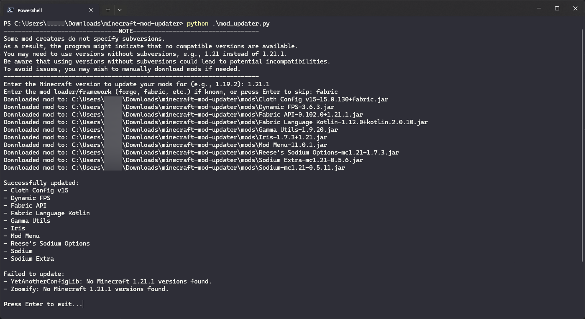
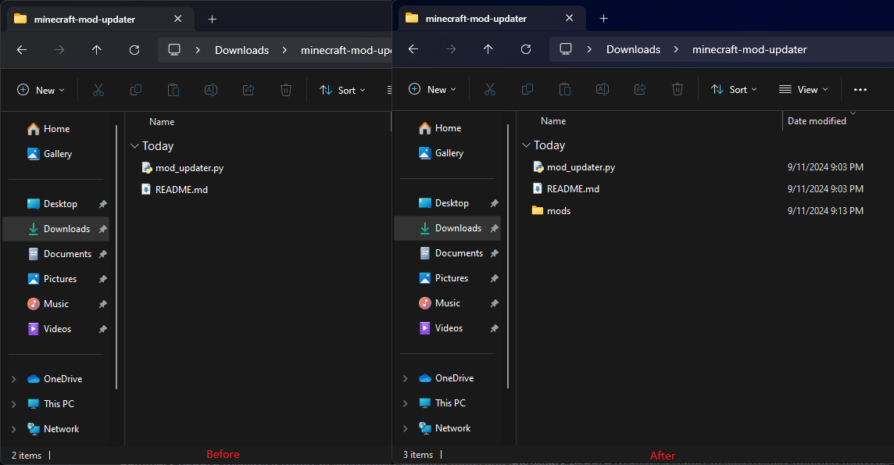

# Minecraft Mod Updater

This Python script automates the process of updating Minecraft mods by downloading the latest compatible versions from Modrinth based on user input. It supports specifying Minecraft versions and mod loaders/frameworks (e.g., Forge, Fabric).

## Features

- **Select a Folder**: Choose the folder containing your Minecraft mod `.jar` files.
- **Framework Support**: Filter mods based on the specified loader/framework (e.g., Forge, Fabric).
- **Version Filtering**: Match mods to a specific Minecraft version and loader.
- **Automated Search**: Automatically search for and download the latest compatible mod versions from Modrinth.
- **Summary Report**: Displays a report of successfully updated mods and any failures.
- **Output Mods Folder**: Produces a new `mods` folder that you can drag into your Minecraft directory to replace the old mods.

## How It Works

1. **Read Mod Folder**:
   - You select your Minecraft mods folder, and the script scans it for `.jar` mod files.

2. **Extract Mod Name**:
   - For each mod, the script reads the `fabric.mod.json` file (if available) to extract the mod name.

3. **Search Modrinth**:
   - It uses the Modrinth API to search for mods by name and retrieves all available versions.

4. **Filter by Minecraft Version and Loader**:
   - The script filters mod versions based on the specified Minecraft version and mod loader (e.g., Forge, Fabric).

5. **Download Latest Version**:
   - The latest compatible version of the mod is downloaded and saved to a new `mods` folder.

6. **Drag and Replace**:
   - After the script finishes, you can drag the newly created `mods` folder into your Minecraft directory to replace the old mods.

7. **Review Results**:
   - The script provides a summary of which mods were successfully updated and which failed.

## Installation

1. **Clone the Repository**:
    ```bash
    git clone https://github.com/EssoweBekley/minecraft-mod-updater.git
    cd minecraft-mod-updater
    ```

2. **Install Dependencies**:
    Ensure you have Python installed, then install the required packages:
    ```bash
    pip install requests
    ```

## Usage

1. **Run the Script**:
    ```bash
    python mod_updater.py
    ```

2. **Follow the Prompts**:
    - Select the folder containing your Minecraft mod `.jar` files.
    - Enter the Minecraft version you want to update to (e.g., `1.19.2`).
    - Specify the mod loader/framework if known (e.g., `forge`, `fabric`), or press Enter to skip.

3. **Review the Results**:
    - The script will output the status of each mod update.
    - After completion, it will prompt you to press Enter to exit.

4. **Replace Mods**:
    - Drag the generated `mods` folder into your Minecraft directory to update your mods.

## Example Output





